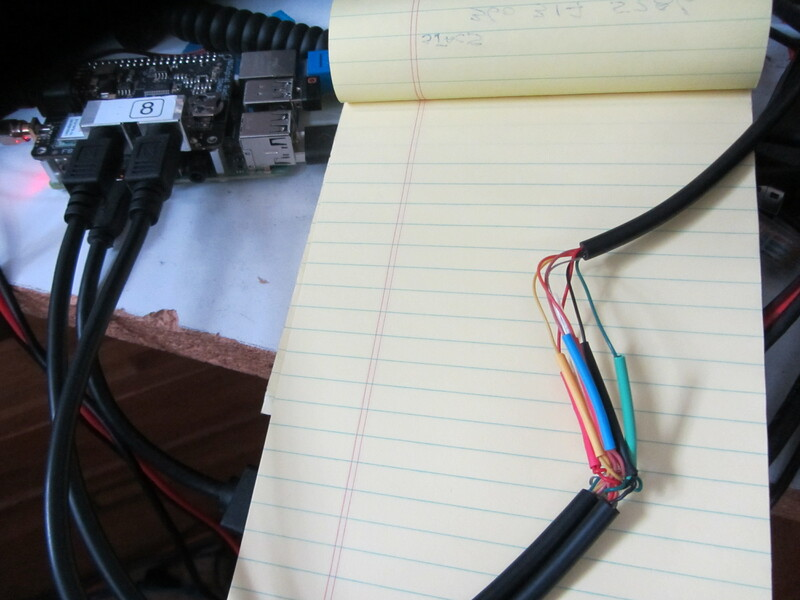
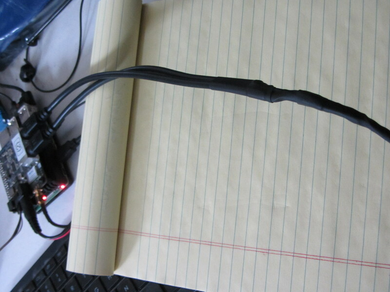

## How to run both 1200 & 9600 baud on a DRAWS Hat

### Introduction

Went through the following iterations:

##### 1. Using PulseAudio #####

  * Some time ago PulseAudio switched from running in system space to user space
    * That change caused increased latency and initial tests showed that packet connected modes were severely affected

##### 2. Manually change Direwolf baud rate #####

* Manually change Direwolf baud rate with a script (_speed_switch.sh_)
  * The _speed_switch.sh_ script provides a reliable way to switch between two baud rates

##### 3. Remotely change baud rate using Direwolf Touch Tone #####
* [Remotely change baud rate using Direwolf Touch Tone capability](https://github.com/nwdigitalradio/n7nix/tree/master/baudrate/README_TOUCHTONE.md)
  * This provides a way to remotely run the _speed_switch.sh_ script

##### 4. Use __both__ ports of a DRAWS hat with custom cable #####
* Use __both__ ports of a DRAWS hat to have 1200 & 9600 baud active on a single RF channel.
  * This is the simplest and most reliable way to run both 1200 & 9600 baud packet on the same RF channel at the same time.
  * It requires a Y mini Din6 cable to connect both the DRAWS mini Din6 connectors together.

The remainder of this README is for the last method using __both__ ports of a DRAWS hat.

### Radio configuration

* [Brief notes for a Kenwood TM-V71a](https://github.com/nwdigitalradio/n7nix/tree/master/baudrate/README_TOUCHTONE.md#briefly-for-a-Kenwood-tm-v71a)

### Software Installation

* This installation has only been tested with 2 apps:
  * Winlink email
  * APRS using APRX

* run script _both_baud.sh_

### Making a Custom Mini Din 6 Y Cable ###

