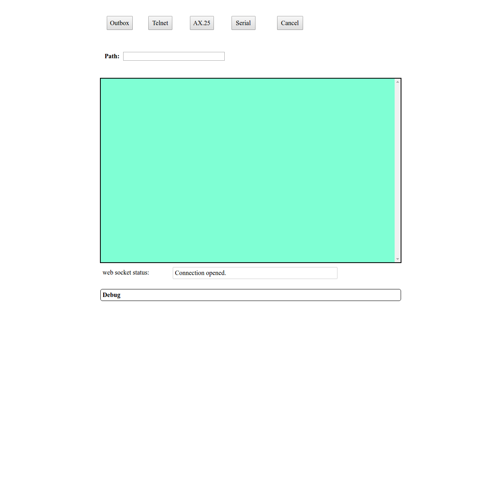

# Linux paclink-unix install for UDRC

## Install core components

* This installation assumes you have already [installed core components](https://github.com/nwdigitalradio/n7nix/blob/master/docs/CORE_INSTALL.md)


## Install paclink-unix, Dovecot & hostap

* This script will install the following:
  * paclink-unix basic
  * dovecot imap mail server
  * hostap for WiFi connection
  * iptables for NAT
  * dnsmasq for DHCP & DNS to enable mobile device connection without
  Internet
  * node.js for web app control of paclink-unix

* You will be required to enter:
  * callsign
  * Winlink password
  * Real name
* To create an SSL certificate you will be required to enter:
  * Country name (2 letter code)
  * State or province (full name)
  * Locality (eg. city)
  * Organization name, skip
  * Organizational Unit Name, skip
  * server FQDN ( eg. check_test5.localnet
  * email address
* For host access point you will be required to enter:
  * SSID (eg. bacon)

* When dialog box for configuring iptables-persistent pops up just hit enter for:
  * 'Save current IPv4 rules?'
  * 'Save current IPv6 rules?'

### Start the Install Script

* **NOTE: You might already have an image with paclink-unix imap installed**
  * Check for any of these conditions:
    * If you installed everything at once using _image_install.sh_
    * If you already have run _app_install.sh pluimap_
    * If you have an image from SeaPac
  * Then continue on to  __Start the Config Script__ section

* Execute the following script from the directory that scripts were cloned to.
  * Should be starting from your login home directory eg. /home/pi

```bash
cd n7nix/config
# should now be in directory ~/n7nix/config
# become root
sudo su
./app_install.sh pluimap
```
* Upon completion you should see:

```
paclink-unix with imap, install script FINISHED

app install (pluimap) script FINISHED
```
### Start the Config Script

```bash
cd n7nix/config
# should now be in directory ~/n7nix/config
# become root
sudo su
./app_config.sh pluimap
```

* When the script finishes you should see:

```
app config (pluimap) script FINISHED
```

#### Note: you will also have to run the hostap/fixed_ip.sh script
* You **MUST** read this script first to set up your fixed ip addresses for both eth0 & wlan interfaces.
* You **MUST** reboot after running the hostap/fixed_ip.sh script

# How to Test Mail client
###### Associate your device running your email client to the RPi WiFi Access Point
* Find the list of WiFi Access Points & select the one on the RPi
  * Look for the name you entered during configuration:

```
Enter Service set identifier (SSID) for new WiFi access point, followed by [enter]:
```


###### Sending mail is a two step process
* Compose an e-mail with your e-mail app
* Send the e-mail with paclink-unix with a web interface

###### Receiving mail is a two step process
* Get e-mail using paclink-unix
* Reading an e-mail with your e-mail app

## Test PLU web interface

### Test webapp

* nodejs & the paclink-unix web app are started automatically with systemd
* Check that systemd started the web app
  * as login user (ie. pi) run the following:

```
pluweb-status
```
* Verify that _active (running)_ is displayed

* There are also 2 commands to start & stop the node.js paclink-unix web app

```
pluweb-stop
pluweb-start
```

* In order to continuously view the web app log you need to execute the following as root:

```
sudo su
journalctl -f -u pluweb.service
```

* Now open a browser & go to: __your_ip_address__:8082
* Should see something like the following:

---



---
* Click on the _Outbox_ button

# Configure a mail client

## [mutt or Neomutt e-mail client](https://www.neomutt.org/)
* mutt is configured by default in the  [mutt install script](https://github.com/nwdigitalradio/n7nix/blob/master/plu/mutt_install.sh)
  * mutt is installed by default when paclink-unix is installed.

## [K-9 Mail Android client](https://k9mail.github.io/)
* Reference configuration for K-9 Mail

### Fetching mail

#### Incoming server

* IMAP server: 10.0.42.99
* Security: SSL/TLS
* Port: 993
* Username: <login_user_name>
* Authentication: Normal password
* Password: <login_password>

### Sending mail

#### Outgoing server

* SMTP server: 10.0.42.99
* Security: SSL/TLS
* Port: 465
* Require sign-in: check mark
* Username: <login_user_name>
* Authentication: Normal password
* Password: <login_password>

